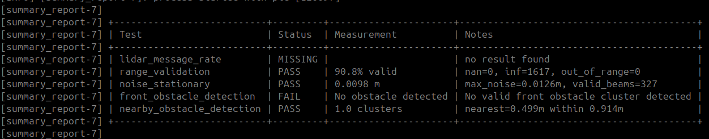
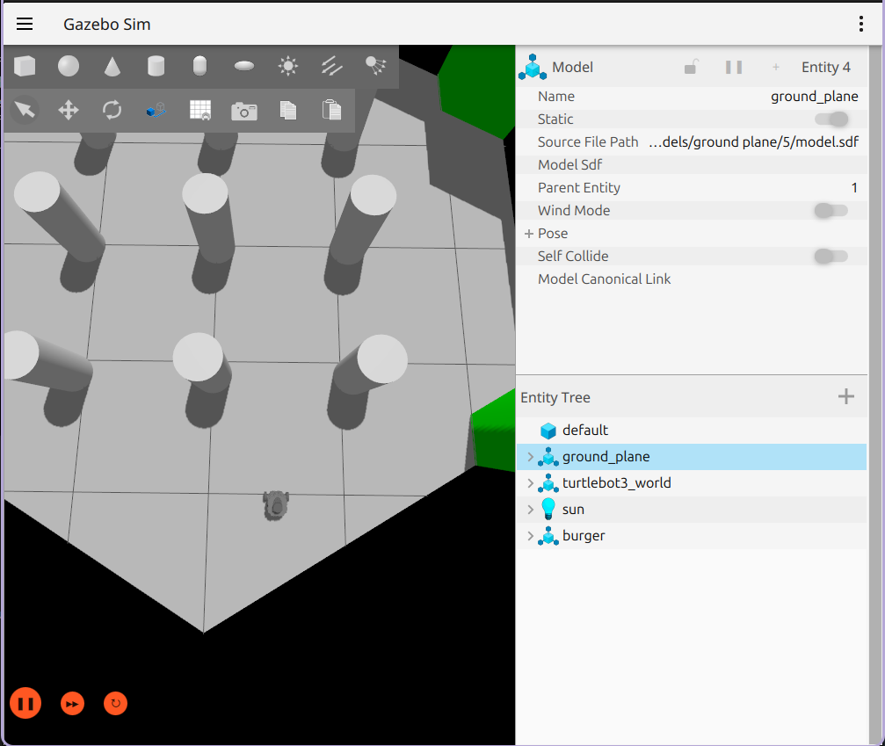
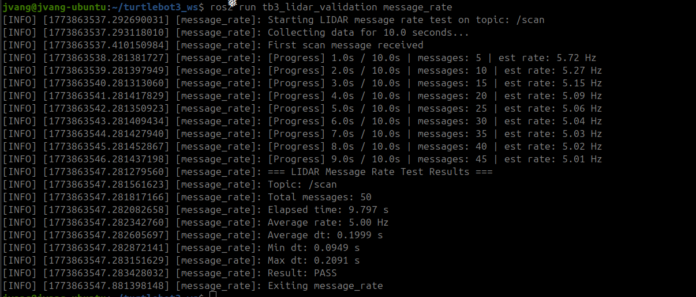
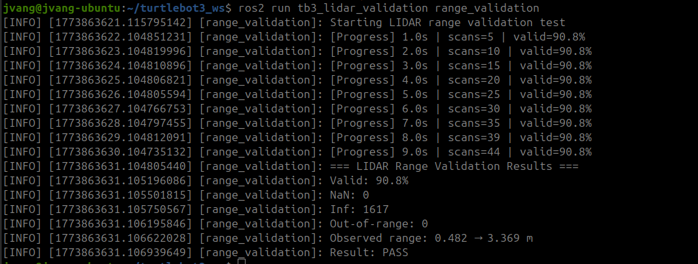
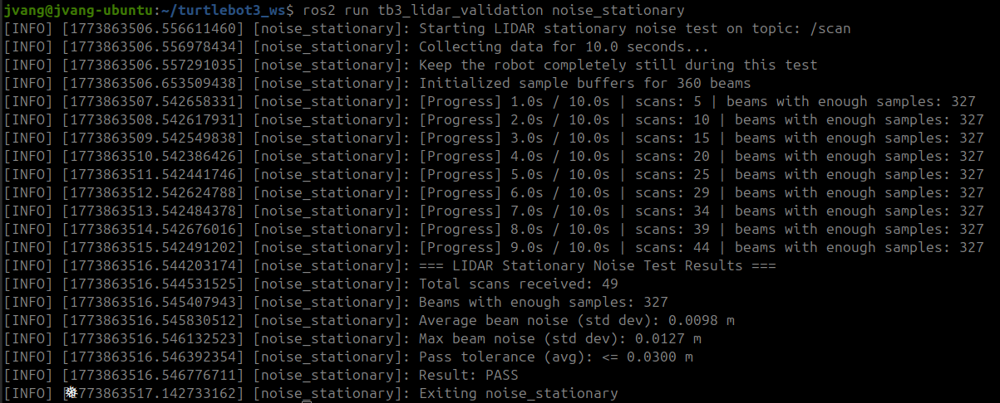
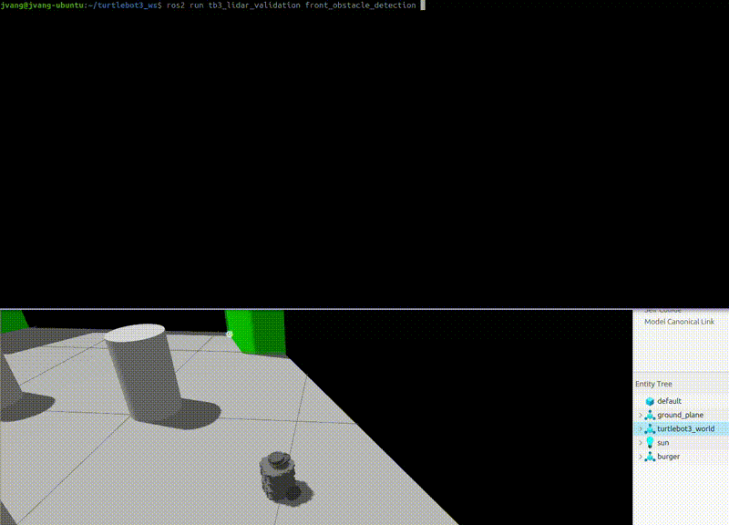
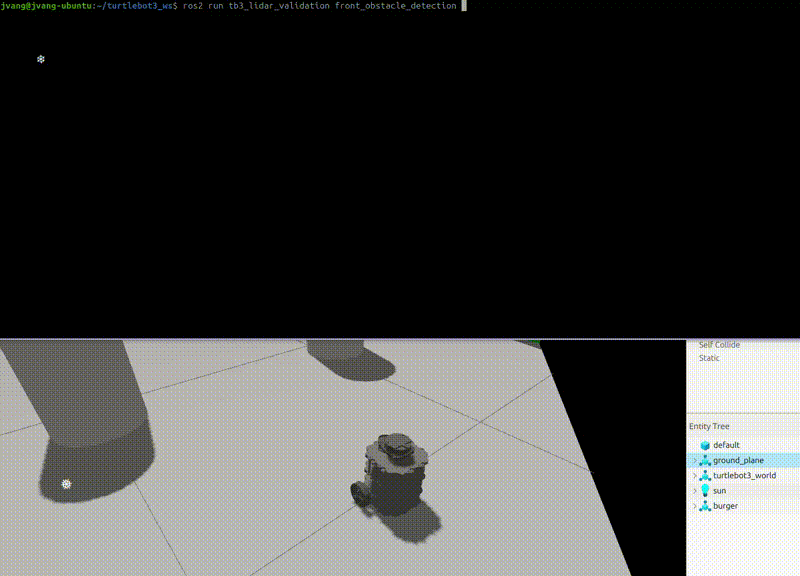
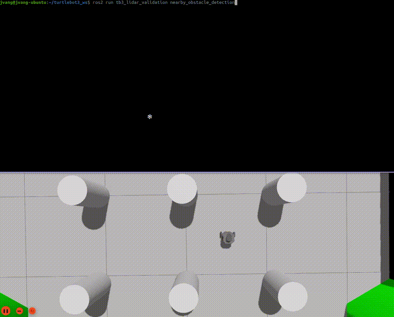

# tb3_lidar_validation

A ROS 2 (Jazzy) LIDAR validation suite for TurtleBot3 focused on scan integrity, noise behavior, and real-world obstacle detection.

This package evaluates how well the `/scan` topic performs before using it in SLAM, navigation, or perception systems.

---

## Overview

This package contains five validation tests:

| Test | Description |
|-----|-------------|
| `lidar_message_rate` | Measure LIDAR publishing frequency and consistency |
| `range_validation` | Validate scan ranges (NaN, inf, out-of-bounds values) |
| `noise_stationary` | Measure noise while robot is stationary |
| `front_obstacle_detection` | Detect and characterize obstacles directly in front |
| `nearby_obstacle_detection` | Detect and cluster nearby objects within a radius |

---

## Demo

### Full Validation Launch

```bash
ros2 launch tb3_lidar_validation lidar_validation_all.launch.py
```

<p align="center">
  
</p>

<p align="center">
  
</p>

---

## Individual Tests

### LIDAR Message Rate

```bash
ros2 run tb3_lidar_validation lidar_message_rate
```

<p align="center">
  
</p>

---

### Range Validation

```bash
ros2 run tb3_lidar_validation range_validation
```

<p align="center">
  
</p>

---

### Stationary Noise

```bash
ros2 run tb3_lidar_validation noise_stationary
```

<p align="center">
  
</p>

---

### Front Obstacle Detection

```bash
ros2 run tb3_lidar_validation front_obstacle_detection
```

#### PASS (object detected)
<p align="center">
  
</p>

#### FAIL (no object detected)
<p align="center">
  
</p>

---

### Nearby Obstacle Detection

```bash
ros2 run tb3_lidar_validation nearby_obstacle_detection
```

<p align="center">
  
</p>

---

## Topics Used

```
/scan
```

These tests validate the perception pipeline:

```
LIDAR → LaserScan (/scan) → filtering → obstacle detection → clustering
```

---

## Why This Matters

Before using SLAM or Nav2, you want to verify:

- LIDAR message stability and rate
- valid range readings (no NaNs, infs, or bad values)
- noise characteristics when stationary
- ability to detect obstacles in front
- ability to detect and separate nearby objects

This package ensures your LIDAR data is reliable before debugging higher-level systems.

---

## Installation

```bash
cd ~/your_ros2_ws/src
git clone https://github.com/johnnyjvang/tb3_lidar_validation.git
```

```bash
cd ~/your_ros2_ws
colcon build
source install/setup.bash
```

---

## Running on Real TurtleBot3

Terminal 1:

```bash
source /opt/ros/jazzy/setup.bash
export TURTLEBOT3_MODEL=burger
ros2 launch turtlebot3_bringup robot.launch.py
```

Terminal 2:

```bash
cd ~/your_ros2_ws
source install/setup.bash
```

Run full suite:

```bash
ros2 launch tb3_lidar_validation lidar_validation_all.launch.py
```

---

## Running in Simulation

Terminal 1:

```bash
source /opt/ros/jazzy/setup.bash
export TURTLEBOT3_MODEL=burger
ros2 launch turtlebot3_gazebo empty_world.launch.py
```

Terminal 2:

```bash
cd ~/your_ros2_ws
source install/setup.bash
```

Run full suite:

```bash
ros2 launch tb3_lidar_validation lidar_validation_all.launch.py
```

---

## Expected Results

### Message Rate

```
Stable rate close to expected (~5–10 Hz depending on model)
Low variation in dt
```

### Range Validation

```
Minimal NaN/inf values
Ranges within sensor limits
```

### Noise Stationary

```
Low variance in distance readings
Stable measurements when robot is not moving
```

### Front Obstacle Detection

```
Detects obstacle in front
Reports nearest distance and cluster width
Fails if no obstacle is present
```

### Nearby Obstacle Detection

```
Reports number of nearby clusters
Identifies nearest obstacle distance
Provides approximate angle and width of each cluster
```

---

## Expected Output

<p align="center">
  
</p>

---

## Package Structure

```text
tb3_lidar_validation/
├── launch/
│   └── lidar_validation_all.launch.py
├── docs/
│   ├── front_obstacle_pass.gif
│   ├── front_obstacle_fail.gif
│   ├── nearby_stationary.gif
│   ├── message_rate.png
│   ├── noise_stationary.png
│   ├── range_validation.png
│   ├── launch_output.png
│   └── launch_stationary.png
├── tb3_lidar_validation/
│   ├── lidar_message_rate.py
│   ├── range_validation.py
│   ├── noise_stationary.py
│   ├── front_obstacle_detection.py
│   ├── nearby_obstacle_detection.py
│   ├── reset_results.py
│   ├── summary_report.py
│   └── result_utils.py
├── package.xml
├── setup.py
├── setup.cfg
└── LICENSE
```

---

## Notes

- Front obstacle detection is designed for quick validation of perception.
- Nearby obstacle detection uses clustering and is approximate, not object recognition.
- Real-world environments may produce more clusters than simulation.
- This package is a strong precursor to SLAM and navigation validation.

---

## License

MIT License
